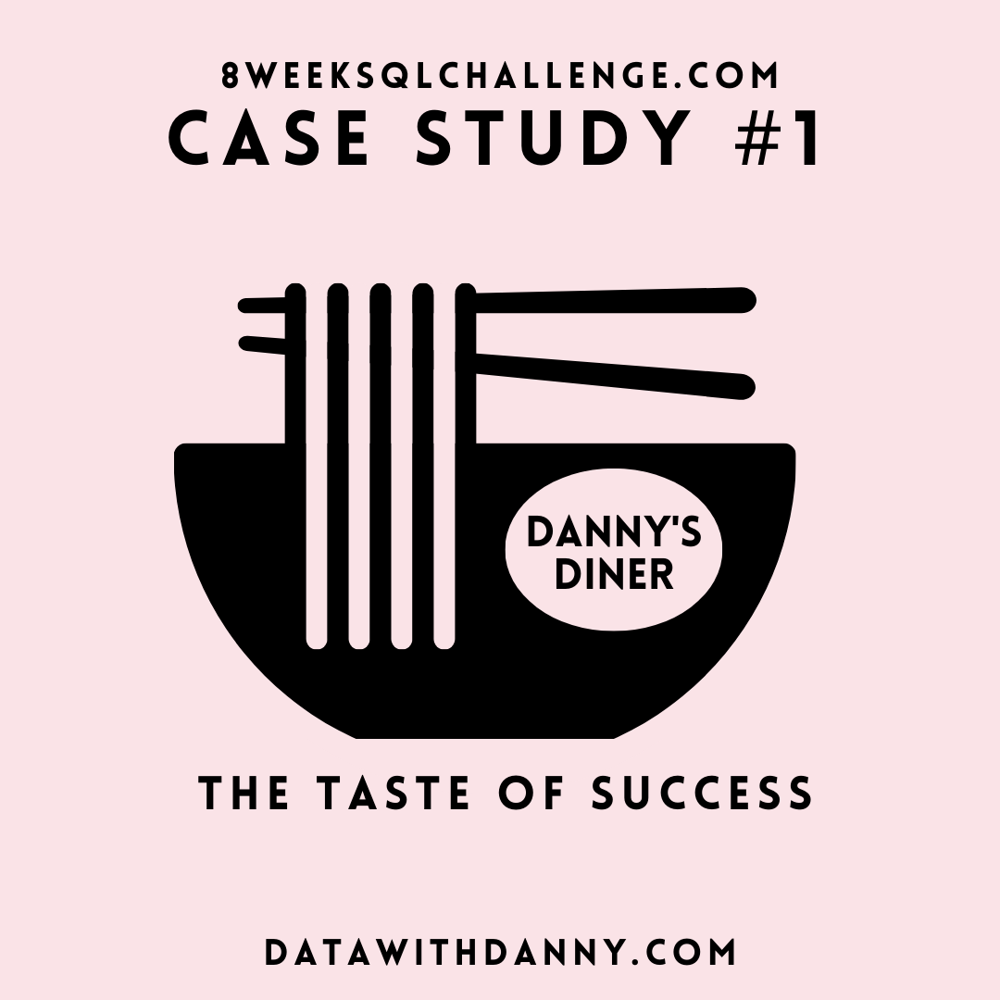
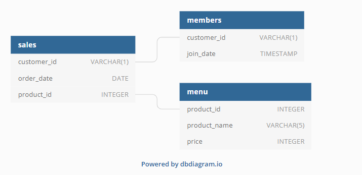

# 🍜 Case Study #1: Danny's Diner 

	

## 📚 Table of Contents
- [Business Task](#business-task)
- [Entity Relationship Diagram](#entity-relationship-diagram)

Please note that all the information regarding the case study has been sourced from the following link: [here](https://8weeksqlchallenge.com/case-study-1/). 

***

## Business Task
Danny wants to use the data to answer a few simple questions about his customers, especially about their visiting patterns, how much money they’ve spent and also which menu items are their favourite. 

## Entity Relationship Diagram

	

