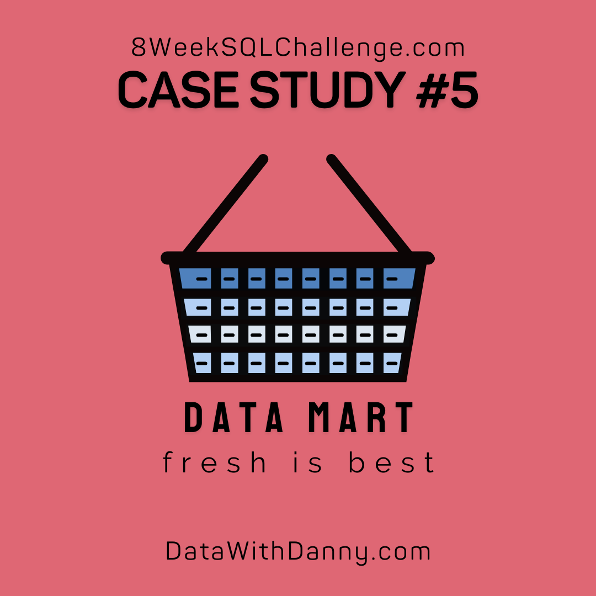

# 🧼 Case Study #5 - Data Mart

	

## 📚 Table of Contents
- [Business Task](#business-task)
- [Entity Relationship Diagram](#entity-relationship-diagram)

Please note that all the information regarding the case study has been sourced from the following link: [here](https://8weeksqlchallenge.com/case-study-4/). 

***

## Business Task
Data Mart is Danny’s latest venture and after running international operations for his online supermarket that specialises in fresh produce - Danny is asking for your support to analyse his sales performance.

In June 2020 - large scale supply changes were made at Data Mart. All Data Mart products now use sustainable packaging methods in every single step from the farm all the way to the customer.

Danny needs your help to quantify the impact of this change on the sales performance for Data Mart and it’s separate business areas.

## Entity Relationship Diagram

	

