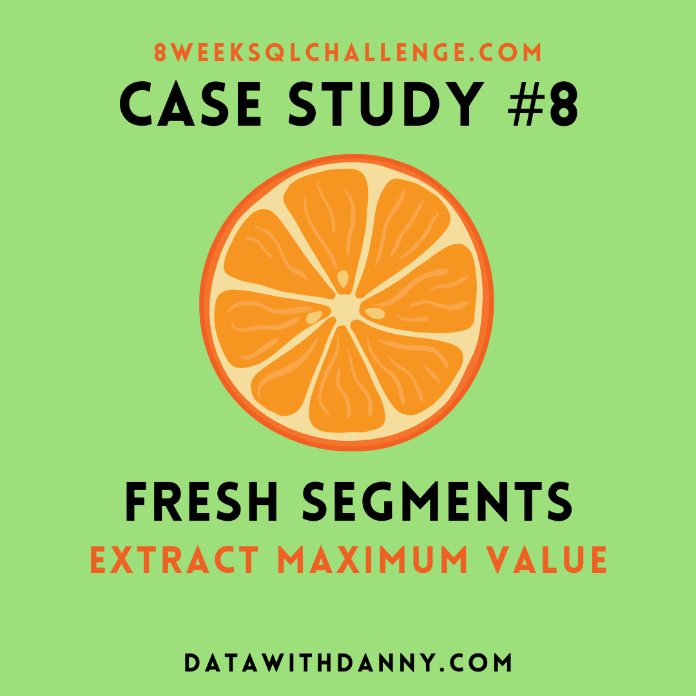

# 🟠 Case Study #8 - Fresh Segments

	

## 📚 Table of Contents
- [Business Task](#business-task)
- [Entity Relationship Diagram](#entity-relationship-diagram)

Please note that all the information regarding the case study has been sourced from the following link: [here](https://8weeksqlchallenge.com/case-study-8/).

***

## Business Task
Danny created Fresh Segments, a digital marketing agency that helps other businesses analyse trends in online ad click behaviour for their unique customer base.

Clients share their customer lists with the Fresh Segments team who then aggregate interest metrics and generate a single dataset worth of metrics for further analysis.

In particular - the composition and rankings for different interests are provided for each client showing the proportion of their customer list who interacted with online assets related to each interest for each month.

Danny has asked for your assistance to analyse aggregated metrics for an example client and provide some high level insights about the customer list and their interests.

## Entity Relationship Diagram
There is no Entity Relationship Diagram in this Case Study.